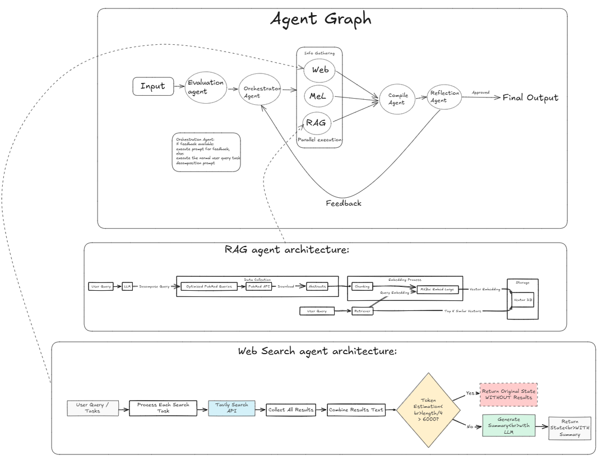

# Medical Research Assistant

Medical Research Assistant is a multi-agent system designed to answer complex medical queries with accuracy, depth, and up-to-date information. It achieves this by dynamically orchestrating specialized AI agents based on the user query and any subsequent feedback. This project is written in TypeScript, runs on **Deno v2.1.6**, and uses **LangGraph** for the agent workflow, **LangChain** for prompt-based pipelines, **Ollama** for local LLM usage, and **Tavily** for searching up-to-date medical sources.

> **Disclaimer**
> The system is intended for research and educational purposes. Its outputs are *not* professional medical advice.

---

## Table of Contents

1. [Key Components](#key-components)
2. [High-Level Flow](#high-level-flow)
3. [Architecture Diagram](#architecture-diagram)
4. [Detailed Agent Workflow](#detailed-agent-workflow)
5. [Iteration &amp; Feedback Mechanism](#iteration--feedback-mechanism)
6. [Installation &amp; Setup](#installation--setup)
7. [Usage](#usage)
8. [Technical Notes](#technical-notes)
9. [Roadmap](#roadmap)
10. [License &amp; Disclaimer](#license--disclaimer)

---

## Key Components

- **LangGraph**: Orchestrates the agents via a directed graph, allowing for conditional transitions (e.g., if a check fails, the flow returns to a previous node).
- **LangChain**: Provides modular prompt templates and structured output parsing for each agent.
- **Deno v2.1.6**: Offers native TypeScript support and built-in utilities (like streaming).
- **Groq Llama 3.3 70B (LLM)**: Used for orchestrating tasks, web search summarization, and final response compilation.
- **LightEternal-Llama3-Merge-Biomed-8B-GGUF:Q8_0 (Medical SLM)**: Used by the **MedILlama Agent** for domain-specific medical knowledge and by the **Reflection Agent** for quality checks.
- **Tavily**: Web search API that retrieves and summarizes relevant, reputable medical information.
- **RAG Agent (Work in Progress)**: Will search research paper abstracts from PubMed, storing them in a vector DB for later retrieval and filtering.

---

## High-Level Flow

1. **User Query Received**

   - The **Evaluation Agent** checks if it’s a basic (“SIMPLE”) query. If yes, it *immediately* returns an answer.
   - If the query is complex, the system proceeds with deeper orchestration.
2. **Orchestration & Decomposition**

   - The **Orchestration Agent** examines the user query (and possibly reflection feedback from a prior cycle).
   - It decides which specialized agents to call, splitting the query into actionable sub-tasks (e.g., “Gather clinical guidelines on X,” “Search real-time data for Y”).
   - It assigns generated tasks to the most suitable agents.
3. **Agents Gather Information in Parallel**

   - **MedILlama**: Offers in-depth, domain-specific knowledge.
   - **Web Search**: Uses Tavily to fetch current medical literature, guidelines, and sources.
   - **(Future) RAG**: Searches PubMed abstracts, using a vector database to store and filter text.
4. **Compile Agent**

   - Collects all partial results from the above agents, merges them into a single cohesive draft answer.
5. **Reflection Agent**

   - Examines the compiled draft for correctness, completeness, and clinical safety.
   - If quality is acceptable, the final answer is shown to the user.
   - Otherwise, improvement feedback is generated, and the system iterates (returning to **Orchestration** with the new feedback).

This design ensures that only the relevant agents are invoked and uses **parallel agent execution wherever possible**, reducing overhead and improving answer quality.

---

## Architecture Diagram



The diagram might show how each agent connects within the workflow:

- **Evaluation** → decides `simple` vs. `complex`
- **Orchestration** → decomposes tasks and assigns them to appropriate agents
- **MedILlama/Web Search/RAG** → gather medical data in parallel
- **Compile** → unify outputs and format it in proper structure with appropriate citations
- **Reflect** → quality check and potential feedback loop

---

## Detailed Agent Workflow

Below is a deeper look at each agent and how it ties into the state graph (see `agentGraph.ts`).

### 1. Evaluation Agent

- **File**: `agents/evaluationAgent.ts`
- **Purpose**:
  1. Quickly decide if the user’s query can be answered with general medical knowledge.
  2. If the prompt is recognized as “SIMPLE,” it outputs a brief direct answer.
  3. Otherwise, it labels the query as “COMPLEX,” allowing the system to proceed with the orchestration logic.
- **Mechanism**:
  - Uses a prompt (`queryEvaluationPrompt`) with the Groq LLM.
  - If the LLM returns output starting with “SIMPLE: …”, the agent updates the state with that direct response and terminates the flow.
  - If not, it sets `isSimpleQuery = false`, passing the state to the next node.

### 2. Orchestration Agent

- **File**: `agents/orchestrationAgent.ts`
- **Purpose**:
  1. Decompose complex queries into smaller tasks (via `taskDecompositionPrompt`) on the **first iteration**.
  2. If a reflection feedback message exists (meaning a prior answer failed QC), use `improvementPrompt` to revise tasks and address the reflection concerns.
- **Mechanism**:
  - Checks whether we have reflection feedback or not.
  - If **no** reflection feedback: Use the `taskDecompositionPrompt` to create tasks for relevant agents.
  - If **yes**: Use the `improvementPrompt` to refine or add tasks that fix identified gaps.
  - The result is a set of tasks structured as `tasks.MedILlama`, `tasks.WebSearch`, and potentially `tasks.RAG`, plus a `requiredAgents` object indicating which agents are needed.

### 3. MedILlama Agent

- **File**: `agents/medILlama.ts`
- **Purpose**:
  1. Handle domain-specific medical analysis, using the smaller but domain-tuned “LightEternal-Llama3-Merge-Biomed-8B” model.
  2. Produce thorough text blocks focusing on correctness and detail, *not* final presentation.
- **Mechanism**:
  - Receives queries (sub-tasks) from the Orchestration step (e.g., “Explain pathophysiology of T2DM in older patients”).
  - Uses `medILlamaPrompt` with the finetuned medical model to generate a concise but rich medical explanation.
  - Appends output to the state (e.g., `state.medILlamaResponse`).

### 4. Web Search Agent

- **File**: `agents/webSearchAgent.ts`
- **Purpose**:
  1. Retrieve up-to-date research and guidelines from reliable sources using **Tavily**.
  2. Summarize the search results, returning a condensed “batch summary” plus extracted references/URLs.
- **Mechanism**:
  - Sub-tasks from the Orchestration might say “Find the latest guidelines on X.”
  - For each sub-task, calls Tavily to get a top set of results (titles, snippets, URLs).
  - Summaries are generated by a prompt (`searchSummaryPrompt`) using the Groq LLM.
  - Stored in `state.webSearchResponse`.

### 5. Compile Agent

- **File**: `agents/compileAgent.ts`
- **Purpose**:
  1. Combine partial information from **MedILlama** and **Web Search** (and eventually **RAG**) into a cohesive draft.
  2. Optionally incorporate prior reflection feedback to refine an existing final response.
- **Mechanism**:
  - Uses `compileAgentPrompt` or `compileWithoutWebPrompt` (depending on whether web search was used) with the Groq LLM.
  - If reflection feedback is available, it uses a specialized refinement template (`compileRefinementPrompt`) to correct or expand on specific points.
  - Writes to `state.finalResponse`.

### 6. Reflection Agent

- **File**: `agents/reflectionAgent.ts`
- **Purpose**:
  1. Act as a **final** quality check on the compiled answer, using the **LightEternal-Llama3-Merge-Biomed-8B** model.
  2. Identify missing context, inaccurate statements, or harmful advice.
  3. Return “Passed” or “Failed” with potential improvement instructions.
- **Mechanism**:
  - The compiled response is input, with system instructions requiring the agent to highlight medical issues, coverage gaps, or compliance with guidelines.
  - If quality fails, it sets `reflectionFeedback` in the state, triggering another iteration in the Orchestration Agent.
  - If it passes, the flow ends and the final response is delivered to the user.

---

## Iteration & Feedback Mechanism

1. **Initial Pass**

   - Once the **Evaluation Agent** determines a query is **not** simple, the **Orchestration Agent** distributes sub-tasks to relevant agents (e.g., MedILlama, Web Search, future RAG) **in parallel**.
   - Each agent gathers or generates content focused on its specialization.
   - The **Compile Agent** merges these partial outputs into an initial draft.
2. **Reflection Check**

   - The **Reflection Agent** analyzes the compiled draft for gaps, inaccuracies, or harmful advice, relying on the domain-tuned medical model.
   - If the answer **passes**, the workflow ends and displays the final answer to the user.
   - If it **fails**, reflection feedback is generated.
     - **Example Feedback**: “Quality check failed: Important treatment contraindications are missing for hypertensive patients with CKD.”
3. **Improvement Cycle**

   - The system sets `qualityPassed = false`, increments `iterationCount`, and stores the feedback in `reflectionFeedback`.
   - The **Orchestration Agent** reads this feedback and revises or adds tasks (using the `improvementPrompt`), prompting the sub-agents to fill the identified gaps.
   - A new compile pass integrates any additional data.
   - This cycle continues until one of two conditions is met:
     1. `qualityPassed = true` → The reflection agent approves the updated response.
     2. **`MAX_ITERATIONS`** is reached (default is 3) → The system stops further attempts to refine the answer, returning the latest version even if imperfect, to prevent endless loops.

In short, **parallel information gathering** shortens processing time and improves coverage, while **iterative refinement** ensures that medically crucial details aren’t overlooked.

---

## Installation & Setup

### 1. Configure Environment Variables

Create a `.env` file in the root directory with the following content:

```env
GROQ_API_KEY=YOUR_GROQ_API_KEY
TAVILY_API_KEY=YOUR_TAVILY_API_KEY
OLLAMA_MODEL=hf.co/featherless-ai-quants/lighteternal-Llama3-merge-biomed-8b-GGUF:Q8_0
OLLAMA_BASE_URL=http://localhost:11434
```

### 2. Prepare the Medical Model

Make sure Ollama is installed on your system.
Then, download and start the medical fine-tuned model locally:

```bash
ollama pull hf.co/featherless-ai-quants/lighteternal-Llama3-merge-biomed-8b-GGUF:Q8_0
ollama serve 
```

### 3. Start the Backend (Deno v2.1.6)

Run the backend using Deno:

for websocket server (recommended):

```bash
deno run --allow-env --allow-net --allow-read server/ws.ts
```

for http server:

```bash
deno run --allow-env --allow-net --allow-read server/http.ts
```

By default, the backend listens on port 8080 for both:

- HTTP API (/)
- WebSocket endpoint (/ws)

### 4. Run the Front-End (React + Vite)

Navigate to the frontend folder and start the development server:

```bash
cd AgentInterface
npm install
npm run dev
```

This starts the client on http://localhost:5173.
